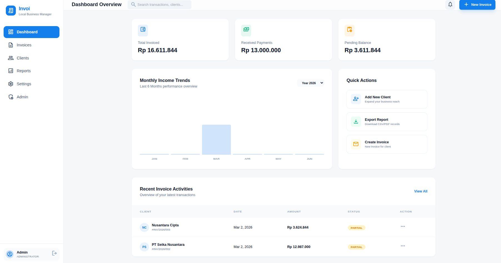
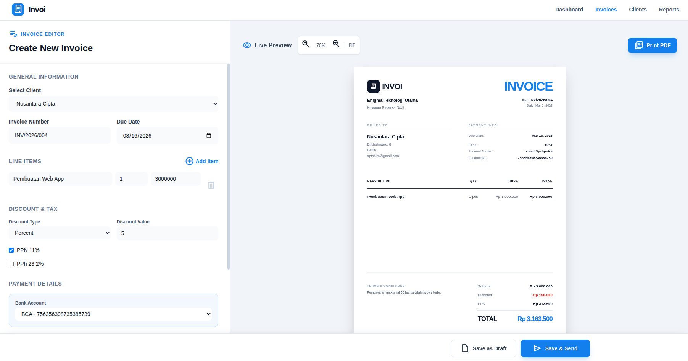

# 📄 Invoi - Invoice Management System

**Invoi** adalah aplikasi manajemen invoice mandiri (self-hosted) yang dirancang untuk freelancer, UMKM, dan kontraktor. Dibuat dengan fokus pada kesederhanaan, kecepatan, dan privasi data menggunakan penyimpanan lokal.

---

## 🚀 Fitur Utama

- **Profil Bisnis**: Kelola identitas bisnis, NPWP, dan multi-rekening bank.
- **Manajemen Klien**: Database klien terpusat untuk mempercepat pembuatan invoice.
- **Invoice Builder Canggih**: Layout *split-view* dengan live preview real-time.
- **Perpajakan & Diskon**: Dukungan PPN (11%), PPh 23, dan diskon per item.
- **Status Tracking**: Pantau siklus hidup invoice (Draft → Sent → Partially Paid → Paid → Overdue).
- **Dashboard Finansial**: Visualisasi total tagihan, pembayaran diterima, dan piutang tertunda.
- **Export & Laporan**: Export laporan bulanan ke CSV dan cetak invoice ke PDF via browser.

---

## 🖼️ Screenshot

<table>
  <tr>
    <td align="center"><strong>Dashboard</strong></td>
    <td align="center"><strong>Invoice Editor</strong></td>
  </tr>
  <tr>
    <td></td>
    <td></td>
  </tr>
</table>

---

## 🛠️ Tech Stack

- **Framework**: [Next.js 14](https://nextjs.org/) (App Router)
- **Styling**: [Tailwind CSS](https://tailwindcss.com/) + [Lucide React Icons](https://lucide.dev/)
- **Database & ORM**: [SQLite](https://sqlite.org/) + [Prisma ORM](https://www.prisma.io/)
- **Containerization**: [Docker](https://www.docker.com/) & [Docker Compose](https://docs.docker.com/compose/)
- **Fonts**: Manrope (via `next/font`)

---

## 💻 Cara Menjalankan Secara Lokal

### Prasyarat
- Node.js versi 18.x atau lebih baru.
- npm atau yarn.

### Langkah-langkah
1. **Clone & Masuk ke Direktori**
   ```bash
   git clone https://github.com/issmileee/invoi.git
   cd invoi
   ```

2. **Instal Dependensi**
   ```bash
   npm install
   ```

3. **Setup Environment**
   Buat file environment dari template:
   ```bash
   cp .env.example .env
   ```

4. **Setup Database**
   Inisialisasi schema database Prisma ke SQLite lokal:
   ```bash
   npx prisma generate
   npx prisma db push
   ```

5. **Build Production (Opsional, untuk verifikasi)**
   ```bash
   npm run build
   ```

6. **Jalankan Aplikasi**
   ```bash
   npm run dev
   ```
   Aplikasi akan tersedia di [http://localhost:3000](http://localhost:3000).

---

## 🐳 Menjalankan Menggunakan Docker

Metode ini sangat disarankan untuk penggunaan stabil (production-like) karena data akan tersimpan dengan aman di dalam volume Docker.

1. **Build dan Jalankan Container**
   Pastikan Docker Desktop sudah aktif, lalu jalankan:
   ```bash
   docker-compose up -d --build
   ```

2. **Akses Aplikasi**
   Buka [http://localhost:3000](http://localhost:3000) di browser Anda.

3. **Menghentikan Layanan**
   ```bash
   docker-compose down
   ```

---

## 📂 Struktur Project

- `app/` - Routing dan komponen halaman (Next.js App Router).
- `components/` - Komponen UI yang dapat digunakan kembali.
- `prisma/` - Definisi schema database (`schema.prisma`) dan file database SQLite.
- `public/` - Aset statis seperti gambar dan font.
- `lib/` - Utilitas fungsi dan konfigurasi database.

---

---

## 📝 Catatan Penting
Pada penggunaan pertama kali, sistem akan mengarahkan Anda ke halaman **/onboarding**. Pastikan Anda mengisi profil bisnis dan pengaturan bank agar data tersebut muncul secara otomatis di setiap invoice yang Anda buat.

---
*Dibuat dengan ❤️ untuk efisiensi bisnis Anda.*
